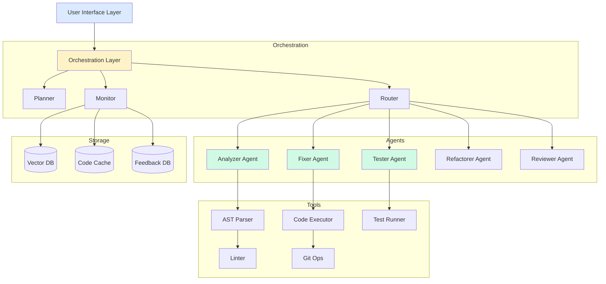

# Design Your Agent

## Module 10: Learning Objectives

By the end of this module, you will:
- ✓ Design a complete autonomous software engineering agent
- ✓ Implement multi-agent orchestration with specialized roles
- ✓ Integrate all concepts from previous chapters
- ✓ Deploy a production-ready agent system
- ✓ Evaluate and iterate based on real-world testing

---

## Capstone Project: Autonomous Software Engineering Agent

Welcome to the capstone project! You'll build a sophisticated agent that can analyze codebases, identify issues, propose fixes, write tests, and refactor code autonomously.

## Project Overview

### What We're Building

An **Autonomous Software Engineering Agent** that can:
- Analyze code quality and identify bugs
- Generate fixes with explanations
- Write comprehensive tests
- Refactor code for better maintainability
- Review pull requests
- Learn from feedback

### Why This Project?

This capstone integrates nearly everything from the course:
- **ReAct pattern** (Module 2): Reasoning and acting on code
- **Planning** (Module 3): Breaking down complex refactoring tasks
- **Memory** (Module 3): Remembering codebase patterns and past fixes
- **Code execution** (Module 4): Running and validating code
- **Production patterns** (Module 5): Safety, testing, monitoring
- **Specialized agents** (Module 6): Coding agent capabilities
- **Learning** (Module 7): Adapting from feedback
- **Enterprise scale** (Module 8): Handling large codebases
- **Frontier capabilities** (Module 9): Self-improvement, tool creation

## Requirements Gathering

### Functional Requirements

**Core Capabilities**:
1. **Code Analysis**: Parse and understand code structure
2. **Bug Detection**: Identify potential issues
3. **Fix Generation**: Propose and implement fixes
4. **Test Generation**: Create comprehensive tests
5. **Refactoring**: Improve code quality
6. **PR Review**: Analyze changes and provide feedback

**User Interactions**:
- Natural language commands ("Fix the bug in auth.py")
- File/directory targeting
- Interactive clarifications
- Progress reporting
- Explanation of changes

### Non-Functional Requirements

**Performance**:
- Analyze files < 5 seconds
- Generate fixes < 30 seconds
- Handle codebases up to 100K lines

**Reliability**:
- Never break working code
- Validate all changes
- Rollback capability
- 95%+ test coverage for generated code

**Safety**:
- Sandbox code execution
- No destructive operations without confirmation
- Backup before modifications
- Security vulnerability checks

**Usability**:
- Clear explanations
- Confidence scores
- Alternative solutions
- Learning from user feedback

## Architecture Design

### High-Level Architecture



### Component Design

**1. Orchestration Layer**

```python
from typing import Dict, List, Optional
from dataclasses import dataclass
from enum import Enum

class TaskType(Enum):
    ANALYZE = "analyze"
    FIX_BUG = "fix_bug"
    WRITE_TEST = "write_test"
    REFACTOR = "refactor"
    REVIEW_PR = "review_pr"

@dataclass
class Task:
    type: TaskType
    target: str  # File or directory
    description: str
    priority: int
    dependencies: List[str]

class Orchestrator:
    """Coordinates multiple specialized agents"""
    
    def __init__(self):
        self.planner = TaskPlanner()
        self.router = AgentRouter()
        self.monitor = ProgressMonitor()
    
    def execute_request(self, request: str, context: Dict) -> Dict:
        """Main entry point"""
        
        # Plan tasks
        tasks = self.planner.create_plan(request, context)
        
        # Execute tasks
        results = []
        for task in tasks:
            # Route to appropriate agent
            agent = self.router.get_agent(task.type)
            
            # Execute
            result = agent.execute(task)
            results.append(result)
            
            # Monitor progress
            self.monitor.update(task, result)
        
        # Synthesize results
        return self.synthesize_results(results)
```

**2. Agent Layer**

```python
class AnalyzerAgent:
    """Analyzes code quality and identifies issues"""
    
    def execute(self, task: Task) -> Dict:
        # Parse code
        # Run static analysis
        # Identify issues
        # Prioritize findings
        pass

class FixerAgent:
    """Generates and applies fixes"""
    
    def execute(self, task: Task) -> Dict:
        # Understand issue
        # Generate fix
        # Validate fix
        # Apply changes
        pass

class TesterAgent:
    """Writes tests for code"""
    
    def execute(self, task: Task) -> Dict:
        # Analyze code
        # Identify test cases
        # Generate tests
        # Validate coverage
        pass

class RefactorerAgent:
    """Refactors code for quality"""
    
    def execute(self, task: Task) -> Dict:
        # Identify code smells
        # Plan refactoring
        # Apply transformations
        # Verify behavior preserved
        pass

class ReviewerAgent:
    """Reviews code changes"""
    
    def execute(self, task: Task) -> Dict:
        # Analyze diff
        # Check for issues
        # Suggest improvements
        # Approve or request changes
        pass
```

**3. Tool Layer**

```python
class CodeTools:
    """Low-level code manipulation tools"""
    
    def parse_ast(self, code: str, language: str) -> Dict:
        """Parse code into AST"""
        pass
    
    def execute_code(self, code: str, test_input: any) -> any:
        """Execute code safely"""
        pass
    
    def run_linter(self, file_path: str) -> List[Dict]:
        """Run linter on code"""
        pass
    
    def format_code(self, code: str, language: str) -> str:
        """Format code"""
        pass
    
    def run_tests(self, test_file: str) -> Dict:
        """Run test suite"""
        pass
    
    def git_diff(self, file_path: str) -> str:
        """Get git diff"""
        pass
```

## Tool Selection

### Required Tools

| Tool | Purpose | Integration |
|------|---------|-------------|
| AST Parser | Code structure analysis | `ast` (Python), `tree-sitter` (multi-lang) |
| Static Analyzer | Bug detection | `pylint`, `mypy`, `ruff` |
| Code Executor | Validation | Docker sandbox |
| Test Framework | Test generation/running | `pytest`, `unittest` |
| Git Integration | Version control | `GitPython` |
| Vector DB | Code search | `chromadb`, `pinecone` |
| LLM API | Reasoning | OpenAI, Anthropic |

### Tool Integration Strategy

```python
class ToolRegistry:
    """Registry of available tools"""
    
    def __init__(self):
        self.tools = {
            "parse_code": {
                "function": self.parse_code,
                "description": "Parse code into AST",
                "parameters": {"code": "str", "language": "str"}
            },
            "run_linter": {
                "function": self.run_linter,
                "description": "Run static analysis",
                "parameters": {"file_path": "str"}
            },
            "execute_code": {
                "function": self.execute_code,
                "description": "Execute code safely",
                "parameters": {"code": "str", "timeout": "int"}
            },
            "run_tests": {
                "function": self.run_tests,
                "description": "Run test suite",
                "parameters": {"test_path": "str"}
            },
            "search_similar_code": {
                "function": self.search_similar_code,
                "description": "Find similar code patterns",
                "parameters": {"query": "str", "limit": "int"}
            }
        }
    
    def get_tool_schemas(self) -> List[Dict]:
        """Get OpenAI function schemas"""
        return [
            {
                "name": name,
                "description": tool["description"],
                "parameters": {
                    "type": "object",
                    "properties": {
                        param: {"type": ptype}
                        for param, ptype in tool["parameters"].items()
                    },
                    "required": list(tool["parameters"].keys())
                }
            }
            for name, tool in self.tools.items()
        ]
```

## Safety Considerations

### Critical Safety Measures

**1. Code Execution Sandbox**
```python
import docker

class SafeExecutor:
    """Execute code in isolated container"""
    
    def __init__(self):
        self.client = docker.from_env()
    
    def execute(self, code: str, timeout: int = 30) -> Dict:
        """Execute with resource limits"""
        
        container = self.client.containers.run(
            "python:3.11-slim",
            command=f"python -c '{code}'",
            detach=True,
            mem_limit="256m",
            cpu_quota=50000,
            network_disabled=True,
            remove=True
        )
        
        try:
            result = container.wait(timeout=timeout)
            logs = container.logs().decode()
            return {"success": True, "output": logs}
        except:
            container.kill()
            return {"success": False, "error": "Timeout or error"}
```

**2. Change Validation**
```python
class ChangeValidator:
    """Validate code changes before applying"""
    
    def validate(self, original: str, modified: str) -> Dict:
        """Multi-level validation"""
        
        checks = {
            "syntax": self.check_syntax(modified),
            "tests_pass": self.run_tests(modified),
            "no_security_issues": self.check_security(modified),
            "behavior_preserved": self.verify_behavior(original, modified)
        }
        
        return {
            "valid": all(checks.values()),
            "checks": checks
        }
```

**3. Human-in-the-Loop**
```python
class ApprovalGate:
    """Require human approval for critical changes"""
    
    def requires_approval(self, change: Dict) -> bool:
        """Determine if change needs approval"""
        
        critical_patterns = [
            "delete", "drop", "remove",
            "auth", "security", "password",
            "production", "deploy"
        ]
        
        return any(pattern in change["description"].lower() 
                  for pattern in critical_patterns)
```

## Success Metrics

### Key Performance Indicators

**Accuracy Metrics**:
- Bug detection rate (precision/recall)
- Fix success rate (% that work)
- Test coverage achieved
- False positive rate

**Efficiency Metrics**:
- Time to analyze file
- Time to generate fix
- Lines of code processed per minute
- Token usage per task

**Quality Metrics**:
- Code quality improvement (linter score)
- Test pass rate
- User acceptance rate
- Regression rate (fixes that break things)

### Measurement Strategy

```python
class MetricsCollector:
    """Collect and track metrics"""
    
    def __init__(self):
        self.metrics = {
            "bugs_detected": 0,
            "fixes_applied": 0,
            "fixes_successful": 0,
            "tests_generated": 0,
            "avg_analysis_time": [],
            "user_approvals": 0,
            "user_rejections": 0
        }
    
    def record_analysis(self, duration: float, bugs_found: int):
        """Record analysis metrics"""
        self.metrics["avg_analysis_time"].append(duration)
        self.metrics["bugs_detected"] += bugs_found
    
    def record_fix(self, success: bool):
        """Record fix attempt"""
        self.metrics["fixes_applied"] += 1
        if success:
            self.metrics["fixes_successful"] += 1
    
    def get_success_rate(self) -> float:
        """Calculate fix success rate"""
        if self.metrics["fixes_applied"] == 0:
            return 0.0
        return self.metrics["fixes_successful"] / self.metrics["fixes_applied"]
```

## Data Flow Design

### Request Processing Flow

```
User Request
    ↓
Parse Intent
    ↓
Create Plan (Task Decomposition)
    ↓
For each task:
    ↓
    Route to Specialized Agent
    ↓
    Execute with Tools
    ↓
    Validate Results
    ↓
    Store in Memory
    ↓
Synthesize Results
    ↓
Present to User
    ↓
Collect Feedback
    ↓
Update Models
```

### State Management

```python
from dataclasses import dataclass
from typing import Optional
import json

@dataclass
class AgentState:
    """Current state of the agent"""
    current_task: Optional[Task]
    task_history: List[Dict]
    codebase_context: Dict
    user_preferences: Dict
    performance_metrics: Dict

class StateManager:
    """Manage agent state"""
    
    def __init__(self, state_file: str = "agent_state.json"):
        self.state_file = state_file
        self.state = self.load_state()
    
    def load_state(self) -> AgentState:
        """Load state from disk"""
        try:
            with open(self.state_file, 'r') as f:
                data = json.load(f)
                return AgentState(**data)
        except:
            return AgentState(
                current_task=None,
                task_history=[],
                codebase_context={},
                user_preferences={},
                performance_metrics={}
            )
    
    def save_state(self):
        """Persist state to disk"""
        with open(self.state_file, 'w') as f:
            json.dump(self.state.__dict__, f, indent=2)
    
    def update_context(self, file_path: str, analysis: Dict):
        """Update codebase context"""
        self.state.codebase_context[file_path] = analysis
        self.save_state()
```

## Memory Architecture

### Multi-Level Memory System

**1. Working Memory**: Current task context
```python
class WorkingMemory:
    """Short-term task context"""
    
    def __init__(self, max_size: int = 10):
        self.max_size = max_size
        self.items = []
    
    def add(self, item: Dict):
        """Add to working memory"""
        self.items.append(item)
        if len(self.items) > self.max_size:
            self.items.pop(0)
    
    def get_context(self) -> str:
        """Get context for LLM"""
        return "\n".join([
            f"- {item['type']}: {item['content']}"
            for item in self.items
        ])
```

**2. Episodic Memory**: Past tasks and solutions
```python
class EpisodicMemory:
    """Remember past tasks"""
    
    def __init__(self):
        self.episodes = []
    
    def store_episode(self, task: Task, solution: Dict, outcome: Dict):
        """Store completed task"""
        self.episodes.append({
            "task": task,
            "solution": solution,
            "outcome": outcome,
            "timestamp": time.time()
        })
    
    def recall_similar(self, current_task: Task, limit: int = 5) -> List[Dict]:
        """Recall similar past tasks"""
        # Use embedding similarity
        return self.episodes[-limit:]
```

**3. Semantic Memory**: Codebase knowledge
```python
import chromadb

class SemanticMemory:
    """Long-term codebase knowledge"""
    
    def __init__(self):
        self.client = chromadb.Client()
        self.collection = self.client.create_collection("codebase")
    
    def index_codebase(self, files: List[str]):
        """Index codebase for semantic search"""
        for file_path in files:
            with open(file_path, 'r') as f:
                code = f.read()
            
            self.collection.add(
                documents=[code],
                metadatas=[{"file_path": file_path}],
                ids=[file_path]
            )
    
    def search(self, query: str, n_results: int = 5) -> List[Dict]:
        """Search for relevant code"""
        results = self.collection.query(
            query_texts=[query],
            n_results=n_results
        )
        return results
```

## Error Handling Strategy

### Graceful Degradation

```python
class RobustAgent:
    """Agent with comprehensive error handling"""
    
    def execute_with_fallbacks(self, task: Task) -> Dict:
        """Execute with multiple fallback strategies"""
        
        strategies = [
            self.primary_strategy,
            self.simplified_strategy,
            self.conservative_strategy
        ]
        
        for strategy in strategies:
            try:
                result = strategy(task)
                if self.validate_result(result):
                    return result
            except Exception as e:
                self.log_error(strategy.__name__, e)
                continue
        
        return {
            "success": False,
            "error": "All strategies failed",
            "recommendation": "Manual intervention required"
        }
```

## Design Decisions

### Key Choices

**1. Multi-Agent vs Single Agent**
- **Choice**: Multi-agent with specialized roles
- **Rationale**: Better separation of concerns, easier to test, more maintainable

**2. Synchronous vs Asynchronous**
- **Choice**: Asynchronous for I/O operations
- **Rationale**: Better performance, can analyze multiple files in parallel

**3. Local vs Cloud Execution**
- **Choice**: Hybrid (local analysis, cloud LLM)
- **Rationale**: Security for code, power for reasoning

**4. Automatic vs Interactive**
- **Choice**: Interactive with automatic mode option
- **Rationale**: Safety for critical changes, speed for routine tasks

**5. Learning Strategy**
- **Choice**: Few-shot + feedback learning
- **Rationale**: Fast adaptation without full retraining

---

> **✅ Key Takeaways**
>
> - Design requires balancing functional and non-functional requirements
> - Multi-agent architecture provides separation of concerns
> - Safety mechanisms are critical for code-modifying agents
> - Memory systems enable learning from past experiences
> - Tool selection impacts capabilities and complexity
> - Architecture decisions should align with use case constraints

## Next Steps

Now that we have the design, let's implement the Autonomous Software Engineering Agent!

In the next section, you'll build:
- Complete working implementation
- All specialized agents
- Tool integrations
- Safety mechanisms
- Real-world examples
