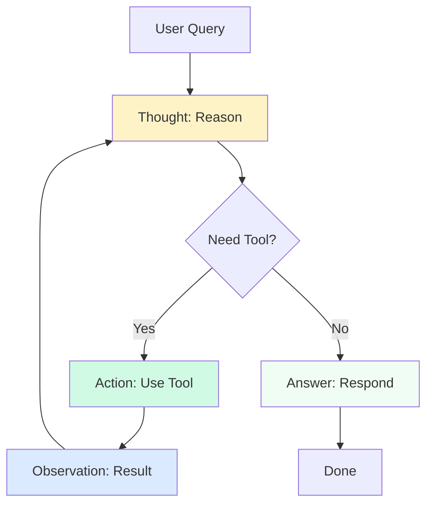

# Simple ReAct Agent

## Module 2: Learning Objectives

By the end of this module, you will:
- ✓ Implement a ReAct agent from scratch
- ✓ Integrate external tools with function calling
- ✓ Handle errors and retries gracefully
- ✓ Build a complete shopping research assistant
- ✓ Understand tool schemas and validation

---

## Introduction to ReAct

**ReAct** (Reasoning + Acting) is the most popular pattern for building AI agents. It combines:
- **Reasoning**: Thinking through what to do
- **Acting**: Taking actions via tools

The agent alternates between thinking and acting until it solves the task.

## The ReAct Pattern



**The ReAct Loop:**
```
Thought: I need to figure out what to do
Action: tool_name(parameters)
Observation: [result from the tool]
Thought: Based on this result, I should...
Action: another_tool(parameters)
Observation: [another result]
Thought: Now I have enough information
Answer: [final response to user]
```

### Why ReAct Works

1. **Transparency**: You can see the agent's reasoning
2. **Debuggability**: Easy to identify where things go wrong
3. **Flexibility**: Works for many types of tasks
4. **Simplicity**: Easy to implement and understand

> **⚠️ Important**
>
> ReAct agents can get stuck in loops or make poor decisions. Always implement max step limits and validation to prevent runaway execution.

## Building Your First ReAct Agent

Let's build a simple agent step by step.

### Step 1: Define the Agent Loop

```python
def react_agent(user_input, max_steps=10):
    """Simple ReAct agent loop"""
    messages = [
        {"role": "system", "content": SYSTEM_PROMPT},
        {"role": "user", "content": user_input}
    ]
    
    for step in range(max_steps):
        # Get LLM response
        response = llm.generate(messages)
        
        # Parse response
        if is_final_answer(response):
            return response
        
        # Execute action
        action, params = parse_action(response)
        result = execute_tool(action, params)
        
        # Add to conversation
        messages.append({"role": "assistant", "content": response})
        messages.append({"role": "user", "content": f"Observation: {result}"})
    
    return "Max steps reached"
```

### Step 2: Create the System Prompt

```python
SYSTEM_PROMPT = """You are a helpful AI agent that can use tools to answer questions.

Available tools:
- search(query): Search the internet for information
- calculate(expression): Evaluate mathematical expressions
- get_time(): Get the current time

Use this format:
Thought: [your reasoning about what to do]
Action: tool_name(parameters)

When you have the final answer:
Answer: [your response to the user]

Example:
User: What is 25 * 17?
Thought: I need to calculate this multiplication
Action: calculate("25 * 17")
Observation: 425
Thought: I have the result
Answer: 25 * 17 equals 425
"""
```

### Step 3: Implement Tool Execution

```python
def execute_tool(action, params):
    """Execute a tool and return the result"""
    tools = {
        "search": search_tool,
        "calculate": calculate_tool,
        "get_time": get_time_tool
    }
    
    if action not in tools:
        return f"Error: Unknown tool '{action}'"
    
    try:
        result = tools[action](params)
        return result
    except Exception as e:
        return f"Error: {str(e)}"
```

### Step 4: Parse Agent Output

```python
import re

def parse_action(response):
    """Extract action and parameters from agent response"""
    # Look for Action: tool_name(params)
    match = re.search(r'Action:\s*(\w+)\((.*?)\)', response)
    
    if match:
        action = match.group(1)
        params = match.group(2).strip('"\'')
        return action, params
    
    return None, None

def is_final_answer(response):
    """Check if response contains final answer"""
    return "Answer:" in response
```

## Complete Working Example

```python
import openai
import re
from datetime import datetime

# Initialize OpenAI
client = openai.OpenAI()

# System prompt
SYSTEM_PROMPT = """You are a helpful AI agent with access to tools.

Tools:
- calculate(expression): Evaluate math expressions
- get_time(): Get current time

Format:
Thought: [reasoning]
Action: tool_name(parameters)

When done:
Answer: [final response]
"""

# Tool implementations
def calculate_tool(expression):
    """Safely evaluate math expressions"""
    try:
        # Only allow safe operations
        allowed = set('0123456789+-*/()., ')
        if not all(c in allowed for c in expression):
            return "Error: Invalid characters in expression"
        return str(eval(expression))
    except Exception as e:
        return f"Error: {str(e)}"

def get_time_tool(_):
    """Get current time"""
    return datetime.now().strftime("%Y-%m-%d %H:%M:%S")

# Tool registry
TOOLS = {
    "calculate": calculate_tool,
    "get_time": get_time_tool
}

# Parsing functions
def parse_action(text):
    """Extract action from agent response"""
    match = re.search(r'Action:\s*(\w+)\((.*?)\)', text)
    if match:
        return match.group(1), match.group(2).strip('"\'')
    return None, None

def is_final_answer(text):
    """Check if agent provided final answer"""
    return "Answer:" in text

# Main agent loop
def react_agent(user_input, max_steps=10):
    """ReAct agent implementation"""
    messages = [
        {"role": "system", "content": SYSTEM_PROMPT},
        {"role": "user", "content": user_input}
    ]
    
    print(f"User: {user_input}\n")
    
    for step in range(max_steps):
        # Get LLM response
        response = client.chat.completions.create(
            model="gpt-4",
            messages=messages,
            temperature=0.1
        )
        
        agent_response = response.choices[0].message.content
        print(f"Agent: {agent_response}\n")
        
        # Check if done
        if is_final_answer(agent_response):
            # Extract final answer
            answer = agent_response.split("Answer:")[1].strip()
            return answer
        
        # Parse and execute action
        action, params = parse_action(agent_response)
        
        if action and action in TOOLS:
            result = TOOLS[action](params)
            observation = f"Observation: {result}"
            print(f"{observation}\n")
            
            # Add to conversation
            messages.append({"role": "assistant", "content": agent_response})
            messages.append({"role": "user", "content": observation})
        else:
            return "Error: Could not parse action or unknown tool"
    
    return "Max steps reached without answer"

# Test the agent
if __name__ == "__main__":
    result = react_agent("What is 123 * 456?")
    print(f"Final Answer: {result}")
```

## Thought-Action-Observation Cycles

Let's trace through an example:

**User**: "What's 15% of 240?"

**Cycle 1:**
```
Thought: I need to calculate 15% of 240, which is 0.15 * 240
Action: calculate("0.15 * 240")
Observation: 36.0
```

**Cycle 2:**
```
Thought: I have the result
Answer: 15% of 240 is 36
```

### Multiple Steps Example

**User**: "What time is it and what's 100 + 50?"

**Cycle 1:**
```
Thought: I need to get the current time first
Action: get_time()
Observation: 2026-02-24 11:19:00
```

**Cycle 2:**
```
Thought: Now I need to calculate 100 + 50
Action: calculate("100 + 50")
Observation: 150
```

**Cycle 3:**
```
Thought: I have both pieces of information
Answer: The current time is 2026-02-24 11:19:00, and 100 + 50 equals 150
```

## Basic Tool Calling

### Tool Definition

Define tools with clear descriptions:

```python
TOOLS = {
    "search": {
        "function": search_tool,
        "description": "Search the internet for information",
        "parameters": {
            "query": "The search query string"
        }
    },
    "calculate": {
        "function": calculate_tool,
        "description": "Evaluate mathematical expressions",
        "parameters": {
            "expression": "Math expression to evaluate (e.g., '2 + 2')"
        }
    }
}
```

### Tool Implementation Best Practices

1. **Validate inputs**: Check parameters before execution
2. **Handle errors**: Return error messages, don't crash
3. **Return strings**: Consistent output format
4. **Be deterministic**: Same input → same output
5. **Add timeouts**: Prevent hanging operations

```python
def search_tool(query):
    """Search tool with validation and error handling"""
    # Validate
    if not query or len(query) < 2:
        return "Error: Query too short"
    
    # Execute with timeout
    try:
        results = search_api(query, timeout=5)
        return format_results(results)
    except TimeoutError:
        return "Error: Search timed out"
    except Exception as e:
        return f"Error: {str(e)}"
```

## Error Handling and Retries

Agents need to handle failures gracefully.

### Detecting Errors

```python
def is_error(observation):
    """Check if tool execution resulted in error"""
    return observation.startswith("Error:")
```

### Retry Logic

```python
def react_agent_with_retry(user_input, max_steps=10, max_retries=3):
    """ReAct agent with retry logic"""
    messages = [
        {"role": "system", "content": SYSTEM_PROMPT},
        {"role": "user", "content": user_input}
    ]
    
    retry_count = 0
    
    for step in range(max_steps):
        response = get_llm_response(messages)
        
        if is_final_answer(response):
            return extract_answer(response)
        
        action, params = parse_action(response)
        result = execute_tool(action, params)
        
        # Handle errors
        if is_error(result) and retry_count < max_retries:
            retry_count += 1
            messages.append({
                "role": "user", 
                "content": f"{result}\nPlease try a different approach."
            })
            continue
        
        retry_count = 0  # Reset on success
        messages.append({"role": "assistant", "content": response})
        messages.append({"role": "user", "content": f"Observation: {result}"})
    
    return "Max steps reached"
```

### Graceful Degradation

```python
# Add to system prompt
"""
If a tool fails:
1. Try an alternative approach
2. If no alternative exists, explain the limitation
3. Provide the best answer you can with available information
"""
```

## Common Pitfalls and Solutions

### Pitfall 1: Infinite Loops
**Problem**: Agent repeats the same action
**Solution**: Track action history, limit repetitions

```python
action_history = []

if action in action_history[-3:]:  # Same action 3 times
    return "Agent stuck in loop, stopping"
    
action_history.append(action)
```

### Pitfall 2: Hallucinated Tools
**Problem**: Agent invents non-existent tools
**Solution**: Strict validation, clear error messages

```python
if action not in TOOLS:
    observation = f"Error: Tool '{action}' does not exist. Available tools: {list(TOOLS.keys())}"
```

### Pitfall 3: Malformed Actions
**Problem**: Agent doesn't follow format
**Solution**: Better prompting, examples, parsing fallbacks

```python
# Add to system prompt
"""
IMPORTANT: Always use exact format:
Action: tool_name(parameters)

Incorrect: "I'll use search tool with query X"
Correct: Action: search("query X")
"""
```

### Pitfall 4: Premature Answers
**Problem**: Agent answers before using tools
**Solution**: Emphasize tool usage in prompt

```python
"""
You MUST use tools to answer questions. Do not guess or use prior knowledge.
Always verify information using available tools.
"""
```

## Testing Your Agent

```python
# Test cases
test_cases = [
    ("What is 50 * 20?", "1000"),
    ("What time is it?", None),  # Time varies
    ("Calculate 100 / 4", "25"),
]

for question, expected in test_cases:
    result = react_agent(question)
    if expected:
        assert expected in result, f"Failed: {question}"
    print(f"✓ {question}")
```

> **💡 Pro Tip**
>
> Start with simple test cases and gradually increase complexity. Log all reasoning traces to understand how your agent makes decisions.

---

> **✅ Key Takeaways**
>
> - ReAct combines reasoning (thinking) with acting (tool use)
> - The agent alternates between Thought, Action, and Observation
> - Always implement max steps to prevent infinite loops
> - Use structured prompts to guide agent behavior
> - Validate tool calls before execution
> - Common pitfalls: loops, hallucinations, premature answers

## Next Steps

You now have a working ReAct agent! In the next section, we'll explore tool integration in depth, including:
- Function calling APIs
- Complex tool schemas
- Parameter validation
- Response parsing strategies
