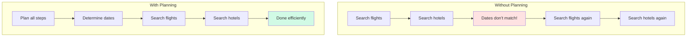

# Planning Agents

## Module 3: Learning Objectives

By the end of this module, you will:
- ✓ Implement planning algorithms (Chain-of-Thought, task decomposition)
- ✓ Build memory systems (short-term, long-term, semantic)
- ✓ Create multi-agent systems with collaboration patterns
- ✓ Understand when to use planning vs reactive approaches
- ✓ Design agent communication protocols

---

## Introduction to Planning

Simple ReAct agents decide one step at a time. **Planning agents** think ahead—they create a multi-step plan before executing, leading to more efficient and coherent task completion.

### Why Planning Matters



**Without Planning (Reactive)**:
- Search flights → Search hotels → Dates mismatch → Redo everything
- Inefficient, multiple retries

**With Planning (Proactive)**:
- Plan: dates → flights → hotels → booking
- Execute efficiently in one pass

> **⚠️ When to Use Planning**
>
> Use planning for:
> - Multi-step tasks with dependencies
> - Tasks requiring coordination
> - Resource-constrained scenarios
>
> Skip planning for:
> - Simple single-step tasks
> - Highly dynamic environments
> - When speed is critical

## Chain-of-Thought Reasoning

Chain-of-Thought (CoT) prompting encourages step-by-step reasoning.

### Basic CoT

```python
SYSTEM_PROMPT = """When solving problems, think step by step:

1. Understand the problem
2. Break it into sub-problems
3. Solve each sub-problem
4. Combine solutions

Example:
User: "I need to prepare for a camping trip next weekend"

Thought: Let me break this down:
1. Determine what items are needed for camping
2. Check what the user already has
3. Create a shopping list for missing items
4. Suggest where to buy them

Now I'll execute this plan..."""
```

### Zero-Shot CoT

Simply add "Let's think step by step":

```python
def zero_shot_cot(query):
    """Use zero-shot chain of thought"""
    prompt = f"{query}\n\nLet's think step by step:"
    return llm.generate(prompt)
```

### Few-Shot CoT

Provide examples of step-by-step reasoning:

```python
FEW_SHOT_EXAMPLES = """
Example 1:
User: "Plan a birthday party for 20 people"
Reasoning:
1. Determine budget and venue
2. Create guest list (20 people)
3. Choose date and send invitations
4. Plan menu and order food
5. Arrange entertainment and decorations
6. Prepare day-of schedule

Example 2:
User: "Debug why my website is slow"
Reasoning:
1. Measure current performance metrics
2. Identify bottlenecks (database, network, code)
3. Prioritize issues by impact
4. Fix highest-impact issues first
5. Re-measure to verify improvements
"""
```

## Task Decomposition

Breaking complex tasks into manageable subtasks.

### Hierarchical Decomposition

```python
def decompose_task(task: str) -> dict:
    """Decompose task into hierarchy"""
    prompt = f"""Break down this task into subtasks:

Task: {task}

Format as:
Main Goal: [goal]
Subtasks:
1. [subtask 1]
   1.1 [sub-subtask]
   1.2 [sub-subtask]
2. [subtask 2]
3. [subtask 3]
"""
    
    response = llm.generate(prompt)
    return parse_task_hierarchy(response)

# Example output
{
    "goal": "Launch a new product",
    "subtasks": [
        {
            "id": 1,
            "task": "Market research",
            "subtasks": [
                {"id": 1.1, "task": "Identify target audience"},
                {"id": 1.2, "task": "Analyze competitors"}
            ]
        },
        {
            "id": 2,
            "task": "Product development"
        },
        {
            "id": 3,
            "task": "Marketing campaign"
        }
    ]
}
```

### Dependency-Aware Decomposition

```python
class Task:
    def __init__(self, name, dependencies=None):
        self.name = name
        self.dependencies = dependencies or []
        self.status = "pending"

def create_task_graph(goal: str) -> List[Task]:
    """Create task graph with dependencies"""
    tasks = [
        Task("Research market", dependencies=[]),
        Task("Design product", dependencies=["Research market"]),
        Task("Build prototype", dependencies=["Design product"]),
        Task("Test prototype", dependencies=["Build prototype"]),
        Task("Launch", dependencies=["Test prototype", "Marketing ready"])
    ]
    return tasks

def get_executable_tasks(tasks: List[Task]) -> List[Task]:
    """Get tasks that can be executed now"""
    return [
        task for task in tasks
        if task.status == "pending" and
        all(dep.status == "completed" for dep in task.dependencies)
    ]
```

## Plan-and-Execute Frameworks

Separate planning from execution for better control.

### Basic Plan-and-Execute

```python
class PlanExecuteAgent:
    """Agent that plans first, then executes"""
    
    def __init__(self):
        self.client = openai.OpenAI()
        self.tools = self._load_tools()
    
    def plan(self, goal: str) -> List[str]:
        """Create execution plan"""
        prompt = f"""Create a detailed plan to accomplish this goal:

Goal: {goal}

Available tools: {', '.join(self.tools.keys())}

Provide a numbered list of steps. Each step should:
- Be specific and actionable
- Use available tools
- Build on previous steps

Plan:"""
        
        response = self.client.chat.completions.create(
            model="gpt-4",
            messages=[{"role": "user", "content": prompt}],
            temperature=0.3
        )
        
        plan_text = response.choices[0].message.content
        steps = self._parse_plan(plan_text)
        return steps
    
    def execute(self, steps: List[str]) -> str:
        """Execute plan steps"""
        results = []
        
        for i, step in enumerate(steps, 1):
            print(f"Executing step {i}: {step}")
            
            # Use ReAct agent to execute each step
            result = self._execute_step(step)
            results.append(result)
            
            # Check if we should continue
            if self._should_replan(result):
                print("Replanning needed...")
                remaining = steps[i:]
                new_plan = self.plan(f"Complete: {', '.join(remaining)}")
                steps = steps[:i] + new_plan
        
        return self._synthesize_results(results)
    
    def run(self, goal: str) -> str:
        """Plan and execute"""
        print(f"Goal: {goal}\n")
        
        # Create plan
        plan = self.plan(goal)
        print("Plan:")
        for i, step in enumerate(plan, 1):
            print(f"  {i}. {step}")
        print()
        
        # Execute plan
        result = self.execute(plan)
        return result
```

### Example Usage

```python
agent = PlanExecuteAgent()

result = agent.run(
    "Research electric cars under $40k and create a comparison report"
)

# Output:
# Goal: Research electric cars under $40k and create a comparison report
# 
# Plan:
#   1. Search for electric cars priced under $40,000
#   2. Get detailed specs for top 5 models
#   3. Compare range, charging time, and features
#   4. Check customer reviews for each model
#   5. Create structured comparison report
#
# Executing step 1: Search for electric cars...
# Executing step 2: Get detailed specs...
# ...
```

## Replanning and Adaptation

Plans often need adjustment based on results.

### When to Replan

```python
def should_replan(step_result: str, original_plan: List[str]) -> bool:
    """Determine if replanning is needed"""
    
    # Error occurred
    if "error" in step_result.lower():
        return True
    
    # Unexpected result
    if "not found" in step_result.lower():
        return True
    
    # New information changes approach
    if "alternative" in step_result.lower():
        return True
    
    return False
```

### Replanning Strategies

**1. Full Replan**: Start over with new information
```python
def full_replan(goal: str, context: str) -> List[str]:
    """Create entirely new plan"""
    prompt = f"""Original goal: {goal}
    
Context from execution so far:
{context}

Create a new plan considering this context:"""
    
    return create_plan(prompt)
```

**2. Partial Replan**: Adjust remaining steps
```python
def partial_replan(remaining_steps: List[str], issue: str) -> List[str]:
    """Adjust remaining steps"""
    prompt = f"""We encountered an issue: {issue}
    
Remaining steps were:
{format_steps(remaining_steps)}

Adjust the plan to work around this issue:"""
    
    return create_plan(prompt)
```

**3. Alternative Path**: Try different approach
```python
def find_alternative(failed_step: str, goal: str) -> str:
    """Find alternative way to accomplish step"""
    prompt = f"""This step failed: {failed_step}
    
Goal: {goal}

Suggest an alternative approach:"""
    
    return llm.generate(prompt)
```

### Adaptive Planning Agent

```python
class AdaptivePlanningAgent:
    """Agent that adapts plan based on execution"""
    
    def __init__(self, max_replans=3):
        self.max_replans = max_replans
        self.replan_count = 0
    
    def execute_with_adaptation(self, goal: str) -> str:
        """Execute with adaptive replanning"""
        plan = self.plan(goal)
        context = []
        
        i = 0
        while i < len(plan):
            step = plan[i]
            
            # Execute step
            result = self.execute_step(step)
            context.append({"step": step, "result": result})
            
            # Check if replanning needed
            if self.should_replan(result):
                if self.replan_count >= self.max_replans:
                    return "Max replans reached. Unable to complete goal."
                
                # Replan remaining steps
                remaining_goal = self.extract_remaining_goal(plan[i+1:])
                new_steps = self.replan(remaining_goal, context)
                
                # Update plan
                plan = plan[:i+1] + new_steps
                self.replan_count += 1
                
                print(f"🔄 Replanned ({self.replan_count}/{self.max_replans})")
            
            i += 1
        
        return self.synthesize_results(context)
```

## Plan Representation

Different ways to represent plans.

### Linear Plan

```python
plan = [
    "Step 1: Search for products",
    "Step 2: Compare prices",
    "Step 3: Read reviews",
    "Step 4: Make recommendation"
]
```

### Tree Plan

```python
plan = {
    "root": "Research product",
    "branches": [
        {
            "node": "Gather information",
            "branches": [
                {"node": "Search products"},
                {"node": "Get specifications"}
            ]
        },
        {
            "node": "Analyze",
            "branches": [
                {"node": "Compare features"},
                {"node": "Check reviews"}
            ]
        },
        {
            "node": "Recommend"}
    ]
}
```

### Graph Plan

```python
from dataclasses import dataclass
from typing import List, Set

@dataclass
class PlanNode:
    id: str
    action: str
    dependencies: Set[str]
    status: str = "pending"

plan_graph = [
    PlanNode("1", "Search products", set()),
    PlanNode("2", "Get details A", {"1"}),
    PlanNode("3", "Get details B", {"1"}),
    PlanNode("4", "Compare", {"2", "3"}),
    PlanNode("5", "Recommend", {"4"})
]

def get_ready_nodes(graph: List[PlanNode]) -> List[PlanNode]:
    """Get nodes ready to execute"""
    completed = {n.id for n in graph if n.status == "completed"}
    
    return [
        node for node in graph
        if node.status == "pending" and
        node.dependencies.issubset(completed)
    ]
```

## Advanced Planning Techniques

### Backward Chaining

Start from goal and work backwards:

```python
def backward_chain(goal: str, current_state: dict) -> List[str]:
    """Plan by working backwards from goal"""
    
    plan = []
    current_goal = goal
    
    while not is_satisfied(current_goal, current_state):
        # What's needed to achieve current_goal?
        prerequisite = find_prerequisite(current_goal)
        plan.insert(0, prerequisite)
        current_goal = prerequisite
    
    return plan

# Example
goal = "Have dinner ready"
# Backward chain:
# "Have dinner ready" requires "Food is cooked"
# "Food is cooked" requires "Ingredients prepared"
# "Ingredients prepared" requires "Groceries purchased"
# Plan: [Buy groceries, Prepare ingredients, Cook food]
```

### Hierarchical Task Network (HTN)

```python
class HTNPlanner:
    """Hierarchical Task Network planner"""
    
    def __init__(self):
        self.methods = {
            "travel_to_city": [
                ["book_flight", "take_flight"],
                ["book_train", "take_train"],
                ["rent_car", "drive"]
            ],
            "book_flight": [
                ["search_flights", "select_flight", "pay"]
            ]
        }
    
    def decompose(self, task: str) -> List[str]:
        """Decompose high-level task"""
        if task not in self.methods:
            return [task]  # Primitive task
        
        # Choose best method
        method = self.select_method(task)
        
        # Recursively decompose
        plan = []
        for subtask in method:
            plan.extend(self.decompose(subtask))
        
        return plan
```

### Monte Carlo Tree Search (MCTS) for Planning

```python
class MCTSPlanner:
    """Use MCTS to find optimal plan"""
    
    def plan(self, goal: str, num_simulations: int = 100):
        """Find plan using MCTS"""
        root = Node(state=initial_state, goal=goal)
        
        for _ in range(num_simulations):
            # Selection
            node = self.select(root)
            
            # Expansion
            if not node.is_terminal():
                node = self.expand(node)
            
            # Simulation
            reward = self.simulate(node)
            
            # Backpropagation
            self.backpropagate(node, reward)
        
        # Return best path
        return self.best_path(root)
```

## Practical Planning Agent

```python
class PracticalPlanningAgent:
    """Production-ready planning agent"""
    
    def __init__(self):
        self.client = openai.OpenAI()
        self.max_steps = 20
        self.max_replans = 3
    
    def run(self, goal: str) -> str:
        """Execute goal with planning"""
        
        # 1. Create initial plan
        plan = self.create_plan(goal)
        print("📋 Initial Plan:")
        for i, step in enumerate(plan, 1):
            print(f"   {i}. {step}")
        print()
        
        # 2. Execute with monitoring
        results = []
        replan_count = 0
        
        for i, step in enumerate(plan):
            print(f"▶️  Step {i+1}/{len(plan)}: {step}")
            
            # Execute step
            result = self.execute_step(step, results)
            results.append({"step": step, "result": result})
            
            # Check success
            if self.is_failure(result):
                if replan_count >= self.max_replans:
                    return self.handle_failure(goal, results)
                
                # Replan
                print(f"⚠️  Step failed, replanning...")
                new_plan = self.replan(goal, plan[i+1:], results)
                plan = plan[:i+1] + new_plan
                replan_count += 1
            
            print(f"✓ Completed\n")
        
        # 3. Synthesize final result
        return self.synthesize(goal, results)
    
    def create_plan(self, goal: str) -> List[str]:
        """Create execution plan"""
        response = self.client.chat.completions.create(
            model="gpt-4",
            messages=[{
                "role": "user",
                "content": f"""Create a step-by-step plan for: {goal}

Requirements:
- Each step should be specific and actionable
- Steps should build on each other logically
- Include verification steps
- Keep it concise (max 10 steps)

Format as numbered list."""
            }],
            temperature=0.3
        )
        
        return self.parse_plan(response.choices[0].message.content)
```

## Best Practices

1. **Plan at the right level**: Not too detailed, not too vague
2. **Include verification**: Check if steps succeeded
3. **Be flexible**: Allow replanning when needed
4. **Consider dependencies**: Respect task ordering
5. **Set limits**: Max steps, max replans
6. **Monitor progress**: Track what's completed
7. **Learn from failures**: Improve planning over time

---

> **✅ Key Takeaways**
>
> - Planning agents create multi-step plans before executing
> - Chain-of-Thought enables step-by-step reasoning
> - Task decomposition breaks complex goals into manageable steps
> - Plan-and-Execute pattern separates planning from execution
> - Replanning allows adaptation when plans fail
> - Use planning for complex, multi-step tasks with dependencies

## Next Steps

You now understand planning agents! Next, we'll explore memory systems that allow agents to remember and learn from past interactions.
