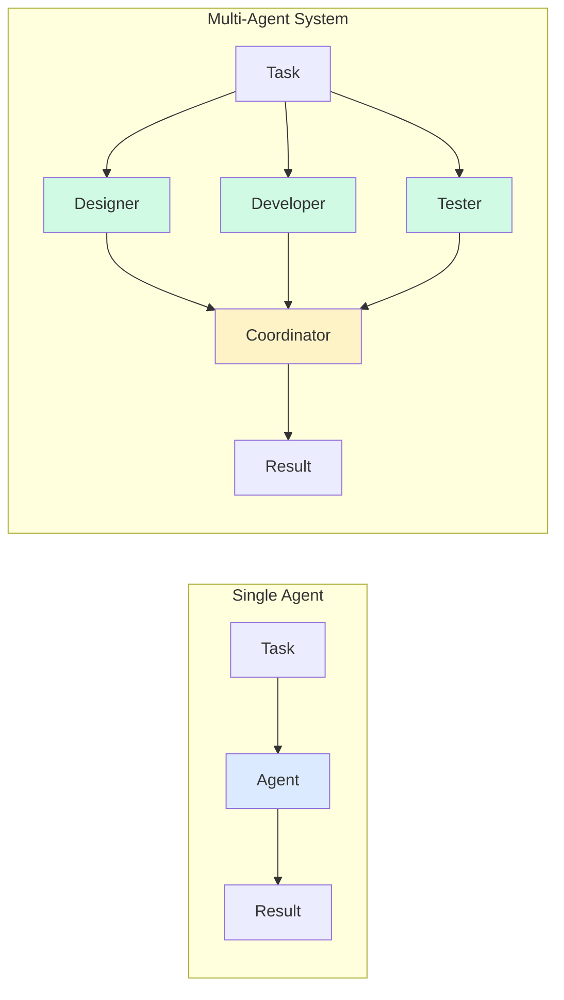

# Multi-Agent Systems

## Why Multiple Agents?

Single agents have limitations. Multiple specialized agents working together can:
- Handle complex tasks requiring diverse expertise
- Work in parallel for faster completion
- Provide checks and balances
- Scale better than monolithic agents



**Example**: Building a website
- **Designer Agent**: Creates UI/UX mockups
- **Developer Agent**: Writes code
- **Tester Agent**: Finds bugs
- **Reviewer Agent**: Ensures quality

> **💡 When to Use Multi-Agent Systems**
>
> Use multiple agents when:
> - Task requires diverse expertise
> - Parallel processing is beneficial
> - Checks and balances are needed
> - Scaling beyond single agent capacity
>
> Stick with single agent when:
> - Task is simple and focused
> - Coordination overhead isn't worth it
> - Real-time response is critical

## Agent Collaboration Patterns

### 1. Sequential (Pipeline)

Agents work one after another:

```
Agent A → Agent B → Agent C → Result
```

```python
class SequentialAgents:
    """Agents work in sequence"""
    
    def __init__(self, agents: List):
        self.agents = agents
    
    def run(self, task: str) -> str:
        """Execute agents sequentially"""
        result = task
        
        for agent in self.agents:
            print(f"→ {agent.name} processing...")
            result = agent.process(result)
        
        return result

# Example
pipeline = SequentialAgents([
    ResearchAgent(),
    AnalysisAgent(),
    WriterAgent()
])

result = pipeline.run("Write a report on AI trends")
# Research → Analysis → Writing
```

### 2. Parallel (Concurrent)

Agents work simultaneously:

```
        ┌─ Agent A ─┐
Task ───┼─ Agent B ─┼─→ Combine → Result
        └─ Agent C ─┘
```

```python
import asyncio

class ParallelAgents:
    """Agents work in parallel"""
    
    def __init__(self, agents: List):
        self.agents = agents
    
    async def run(self, task: str) -> str:
        """Execute agents in parallel"""
        # Run all agents concurrently
        tasks = [agent.process_async(task) for agent in self.agents]
        results = await asyncio.gather(*tasks)
        
        # Combine results
        return self.combine_results(results)
    
    def combine_results(self, results: List[str]) -> str:
        """Merge results from multiple agents"""
        prompt = f"""Combine these results into a coherent response:

{chr(10).join([f"Agent {i+1}: {r}" for i, r in enumerate(results)])}

Combined result:"""
        
        return llm.generate(prompt)

# Example
parallel = ParallelAgents([
    SearchAgent(),
    DatabaseAgent(),
    APIAgent()
])

result = await parallel.run("Find information about user X")
# All agents search simultaneously
```

### 3. Hierarchical (Manager-Worker)

Manager delegates to workers:

```
      Manager
     /   |   \
Worker1 Worker2 Worker3
```

```python
class ManagerAgent:
    """Manages and delegates to worker agents"""
    
    def __init__(self, workers: List):
        self.workers = workers
    
    def run(self, task: str) -> str:
        """Delegate and coordinate"""
        # Break down task
        subtasks = self.decompose_task(task)
        
        # Assign to workers
        assignments = self.assign_tasks(subtasks)
        
        # Collect results
        results = []
        for worker, subtask in assignments:
            result = worker.execute(subtask)
            results.append(result)
        
        # Synthesize final result
        return self.synthesize(results)
    
    def decompose_task(self, task: str) -> List[str]:
        """Break task into subtasks"""
        prompt = f"""Break this task into 3-5 subtasks:

Task: {task}

Subtasks:"""
        
        response = llm.generate(prompt)
        return self.parse_subtasks(response)
    
    def assign_tasks(self, subtasks: List[str]) -> List[tuple]:
        """Assign subtasks to workers"""
        assignments = []
        
        for i, subtask in enumerate(subtasks):
            # Round-robin assignment
            worker = self.workers[i % len(self.workers)]
            assignments.append((worker, subtask))
        
        return assignments
```

### 4. Debate (Adversarial)

Agents debate to reach better conclusions:

```python
class DebateSystem:
    """Agents debate to find best answer"""
    
    def __init__(self, agents: List, rounds: int = 3):
        self.agents = agents
        self.rounds = rounds
    
    def run(self, question: str) -> str:
        """Run debate"""
        positions = []
        
        # Initial positions
        for agent in self.agents:
            position = agent.initial_position(question)
            positions.append(position)
        
        # Debate rounds
        for round_num in range(self.rounds):
            print(f"\n--- Round {round_num + 1} ---")
            
            new_positions = []
            for i, agent in enumerate(self.agents):
                # Show other positions
                other_positions = [p for j, p in enumerate(positions) if j != i]
                
                # Agent responds
                response = agent.respond(question, other_positions)
                new_positions.append(response)
                print(f"{agent.name}: {response[:100]}...")
            
            positions = new_positions
        
        # Judge decides winner
        return self.judge(question, positions)
    
    def judge(self, question: str, positions: List[str]) -> str:
        """Determine best answer"""
        prompt = f"""Question: {question}

Positions:
{chr(10).join([f"{i+1}. {p}" for i, p in enumerate(positions)])}

Which position is most convincing and why?"""
        
        return llm.generate(prompt)
```

### 5. Collaborative (Peer-to-Peer)

Agents work together as equals:

```python
class CollaborativeAgents:
    """Agents collaborate as peers"""
    
    def __init__(self, agents: List):
        self.agents = agents
        self.shared_context = {}
    
    def run(self, task: str) -> str:
        """Collaborative execution"""
        self.shared_context['task'] = task
        self.shared_context['contributions'] = []
        
        # Each agent contributes
        for agent in self.agents:
            contribution = agent.contribute(self.shared_context)
            self.shared_context['contributions'].append({
                'agent': agent.name,
                'content': contribution
            })
            
            # Other agents can see and build on this
            print(f"✓ {agent.name} contributed")
        
        # Synthesize all contributions
        return self.synthesize_contributions()
    
    def synthesize_contributions(self) -> str:
        """Combine all contributions"""
        contributions = self.shared_context['contributions']
        
        prompt = f"""Synthesize these contributions into a final result:

Task: {self.shared_context['task']}

Contributions:
{chr(10).join([f"- {c['agent']}: {c['content']}" for c in contributions])}

Final result:"""
        
        return llm.generate(prompt)
```

## Delegation and Orchestration

### Simple Orchestrator

```python
class Orchestrator:
    """Coordinates multiple agents"""
    
    def __init__(self):
        self.agents = {}
    
    def register_agent(self, name: str, agent):
        """Register an agent"""
        self.agents[name] = agent
    
    def delegate(self, task: str) -> str:
        """Delegate task to appropriate agent"""
        # Determine which agent should handle this
        agent_name = self.select_agent(task)
        
        if agent_name not in self.agents:
            return f"No agent available for: {task}"
        
        # Delegate to agent
        agent = self.agents[agent_name]
        return agent.execute(task)
    
    def select_agent(self, task: str) -> str:
        """Select best agent for task"""
        prompt = f"""Which agent should handle this task?

Task: {task}

Available agents:
{chr(10).join([f"- {name}: {agent.description}" for name, agent in self.agents.items()])}

Best agent:"""
        
        response = llm.generate(prompt)
        return response.strip()
```

### Advanced Orchestrator with Routing

```python
class SmartOrchestrator:
    """Intelligent task routing"""
    
    def __init__(self):
        self.agents = {}
        self.routing_history = []
    
    def register_agent(self, name: str, agent, capabilities: List[str]):
        """Register agent with capabilities"""
        self.agents[name] = {
            'agent': agent,
            'capabilities': capabilities,
            'success_rate': 1.0
        }
    
    def route_task(self, task: str) -> str:
        """Route task to best agent"""
        # Score each agent
        scores = {}
        for name, info in self.agents.items():
            score = self.score_agent(task, info)
            scores[name] = score
        
        # Select best agent
        best_agent = max(scores, key=scores.get)
        
        # Execute
        result = self.agents[best_agent]['agent'].execute(task)
        
        # Update success rate
        self.update_success_rate(best_agent, result)
        
        return result
    
    def score_agent(self, task: str, agent_info: dict) -> float:
        """Score agent suitability"""
        # Check capability match
        capability_score = self.match_capabilities(task, agent_info['capabilities'])
        
        # Consider past success
        success_score = agent_info['success_rate']
        
        # Combined score
        return 0.7 * capability_score + 0.3 * success_score
```

## Consensus and Voting Mechanisms

### Simple Voting

```python
class VotingSystem:
    """Agents vote on decisions"""
    
    def __init__(self, agents: List):
        self.agents = agents
    
    def decide(self, question: str, options: List[str]) -> str:
        """Agents vote on options"""
        votes = {}
        
        for agent in self.agents:
            vote = agent.vote(question, options)
            votes[vote] = votes.get(vote, 0) + 1
        
        # Return option with most votes
        winner = max(votes, key=votes.get)
        return winner

# Example
voters = VotingSystem([
    Agent1(), Agent2(), Agent3()
])

decision = voters.decide(
    "Which framework should we use?",
    ["React", "Vue", "Angular"]
)
```

### Weighted Voting

```python
class WeightedVoting:
    """Agents vote with different weights"""
    
    def __init__(self, agents: List[tuple]):
        # agents = [(agent, weight), ...]
        self.agents = agents
    
    def decide(self, question: str, options: List[str]) -> str:
        """Weighted voting"""
        scores = {option: 0.0 for option in options}
        
        for agent, weight in self.agents:
            vote = agent.vote(question, options)
            scores[vote] += weight
        
        return max(scores, key=scores.get)

# Example
weighted = WeightedVoting([
    (ExpertAgent(), 2.0),    # Expert has 2x weight
    (JuniorAgent(), 1.0),
    (JuniorAgent(), 1.0)
])
```

### Consensus Building

```python
class ConsensusBuilder:
    """Build consensus among agents"""
    
    def __init__(self, agents: List, threshold: float = 0.8):
        self.agents = agents
        self.threshold = threshold
    
    def reach_consensus(self, question: str, max_rounds: int = 5) -> str:
        """Iteratively build consensus"""
        
        for round_num in range(max_rounds):
            # Get opinions
            opinions = [agent.opinion(question) for agent in self.agents]
            
            # Check agreement
            agreement = self.measure_agreement(opinions)
            
            if agreement >= self.threshold:
                return self.synthesize_consensus(opinions)
            
            # Share opinions and iterate
            for agent in self.agents:
                agent.see_opinions(opinions)
        
        return "No consensus reached"
    
    def measure_agreement(self, opinions: List[str]) -> float:
        """Measure how much agents agree"""
        # Use embeddings to measure similarity
        embeddings = [get_embedding(op) for op in opinions]
        
        # Calculate pairwise similarities
        similarities = []
        for i in range(len(embeddings)):
            for j in range(i+1, len(embeddings)):
                sim = cosine_similarity(embeddings[i], embeddings[j])
                similarities.append(sim)
        
        return np.mean(similarities)
```

## Communication Protocols

### Message Passing

```python
class MessageBus:
    """Central message bus for agent communication"""
    
    def __init__(self):
        self.subscribers = {}
        self.messages = []
    
    def subscribe(self, agent_id: str, topics: List[str]):
        """Agent subscribes to topics"""
        for topic in topics:
            if topic not in self.subscribers:
                self.subscribers[topic] = []
            self.subscribers[topic].append(agent_id)
    
    def publish(self, topic: str, message: dict):
        """Publish message to topic"""
        self.messages.append({
            'topic': topic,
            'message': message,
            'timestamp': time.time()
        })
        
        # Notify subscribers
        if topic in self.subscribers:
            for agent_id in self.subscribers[topic]:
                self.deliver(agent_id, message)
    
    def deliver(self, agent_id: str, message: dict):
        """Deliver message to agent"""
        # Implementation depends on agent architecture
        pass
```

### Direct Communication

```python
class Agent:
    """Agent with communication capabilities"""
    
    def __init__(self, name: str):
        self.name = name
        self.inbox = []
        self.peers = {}
    
    def send_message(self, recipient: str, message: str):
        """Send message to another agent"""
        if recipient in self.peers:
            self.peers[recipient].receive_message(self.name, message)
    
    def receive_message(self, sender: str, message: str):
        """Receive message from another agent"""
        self.inbox.append({
            'from': sender,
            'message': message,
            'timestamp': time.time()
        })
    
    def broadcast(self, message: str):
        """Send message to all peers"""
        for peer_name, peer in self.peers.items():
            peer.receive_message(self.name, message)
    
    def add_peer(self, name: str, agent):
        """Add peer agent"""
        self.peers[name] = agent
```

## Complete Multi-Agent System

```python
class MultiAgentSystem:
    """Complete multi-agent system"""
    
    def __init__(self):
        self.agents = {}
        self.message_bus = MessageBus()
        self.orchestrator = Orchestrator()
    
    def add_agent(self, name: str, agent, role: str):
        """Add agent to system"""
        self.agents[name] = {
            'agent': agent,
            'role': role,
            'status': 'idle'
        }
        self.orchestrator.register_agent(name, agent)
    
    def execute_task(self, task: str, strategy: str = 'auto') -> str:
        """Execute task using appropriate strategy"""
        
        if strategy == 'sequential':
            return self.execute_sequential(task)
        elif strategy == 'parallel':
            return self.execute_parallel(task)
        elif strategy == 'hierarchical':
            return self.execute_hierarchical(task)
        else:
            return self.execute_auto(task)
    
    def execute_sequential(self, task: str) -> str:
        """Sequential execution"""
        result = task
        
        for name, info in self.agents.items():
            agent = info['agent']
            result = agent.process(result)
        
        return result
    
    async def execute_parallel(self, task: str) -> str:
        """Parallel execution"""
        tasks = []
        
        for name, info in self.agents.items():
            agent = info['agent']
            tasks.append(agent.process_async(task))
        
        results = await asyncio.gather(*tasks)
        return self.combine_results(results)
    
    def execute_hierarchical(self, task: str) -> str:
        """Hierarchical execution with manager"""
        # Find manager agent
        manager = self.find_manager()
        
        if not manager:
            return "No manager agent available"
        
        # Manager coordinates workers
        return manager.coordinate(task, self.agents)
    
    def execute_auto(self, task: str) -> str:
        """Automatically choose best strategy"""
        # Analyze task complexity
        complexity = self.analyze_task(task)
        
        if complexity['parallel_potential'] > 0.7:
            return asyncio.run(self.execute_parallel(task))
        elif complexity['requires_coordination']:
            return self.execute_hierarchical(task)
        else:
            return self.execute_sequential(task)
```

## Example: Research Team

```python
class ResearchTeam:
    """Multi-agent research team"""
    
    def __init__(self):
        self.researcher = ResearchAgent()
        self.analyst = AnalystAgent()
        self.writer = WriterAgent()
        self.reviewer = ReviewerAgent()
    
    def research_topic(self, topic: str) -> str:
        """Collaborative research"""
        
        # 1. Researcher gathers information
        print("📚 Researcher gathering information...")
        raw_data = self.researcher.gather(topic)
        
        # 2. Analyst analyzes data
        print("📊 Analyst analyzing data...")
        analysis = self.analyst.analyze(raw_data)
        
        # 3. Writer creates report
        print("✍️  Writer creating report...")
        draft = self.writer.write(analysis)
        
        # 4. Reviewer provides feedback
        print("👀 Reviewer checking quality...")
        feedback = self.reviewer.review(draft)
        
        # 5. Writer revises based on feedback
        if feedback['needs_revision']:
            print("🔄 Writer revising...")
            final = self.writer.revise(draft, feedback)
        else:
            final = draft
        
        return final

# Usage
team = ResearchTeam()
report = team.research_topic("AI Agent Architectures")
```

## Best Practices

1. **Clear roles**: Each agent should have a specific purpose
2. **Defined interfaces**: Standardize communication
3. **Avoid bottlenecks**: Don't make everything go through one agent
4. **Handle failures**: One agent failing shouldn't crash the system
5. **Monitor coordination**: Track how agents interact
6. **Balance autonomy**: Agents should be independent but coordinated
7. **Prevent conflicts**: Resolve disagreements systematically
8. **Scale gradually**: Start simple, add complexity as needed
9. **Test interactions**: Verify agents work well together
10. **Document protocols**: Clear communication standards

## Common Pitfalls

### Pitfall 1: Over-coordination
**Problem**: Too much communication overhead
**Solution**: Let agents work independently when possible

### Pitfall 2: Conflicting Goals
**Problem**: Agents work against each other
**Solution**: Align objectives and add conflict resolution

### Pitfall 3: Infinite Loops
**Problem**: Agents keep delegating to each other
**Solution**: Add delegation limits and cycle detection

### Pitfall 4: No Clear Owner
**Problem**: Task falls through the cracks
**Solution**: Always assign clear responsibility

## Next Steps

You now understand multi-agent systems! In Chapter 4, we'll explore the tools and capabilities that make agents powerful, including code execution, data access, and web interaction.
